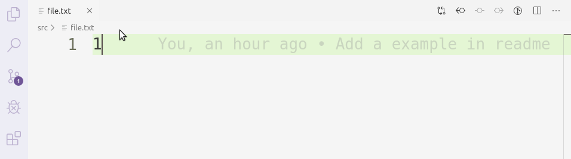

# Diff Default

Open the diff panel with a single simple command, or a shorcut

## features

## example

there are two folders where we need to diff the files one by one

```txt
.
├── project1
│   └── src
│       └── file.txt
└── project2
    └── src
        └── file.txt
```

in `project1`, put the following json in file `.vscode/settings.json`

```json
{
    "diffdefault.rules": [
        [".", "../project2"]
    ]
}
```

now, open `project1` as a workspace, and open the file `src/file.txt`, run `diffdefault`
in the command palette (`f1` or `ctrl`+ `P`).



